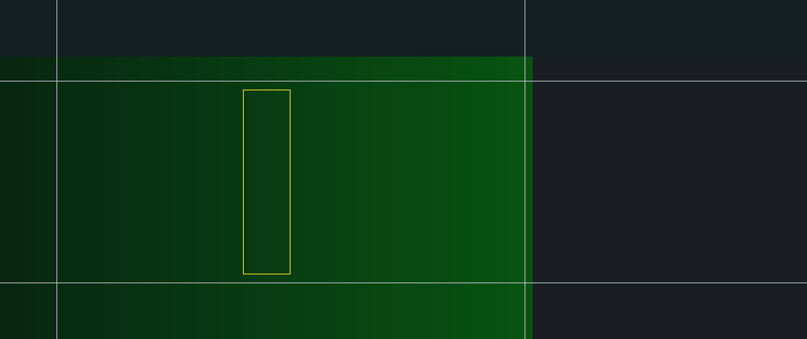

# Multi-Band Overlap and Alerts

This package is included as a **test experiment** for the SONAR Simulator Task.

## Workflow

1. Press **Start** to begin the first phase.
2. Select a bearing region in the BTH by clicking the contact.
3. Inspect the LOFAR frequency history for the selected bearing aperture.
4. Choose a classification, press **Confirm**, then choose confidence **1–4**.
5. If the experiment automatically pauses between phases, press **Resume**.

> The generated audio in this sample package is synthetic test material, not a calibrated or operational sonar recording.

## Confidence

- **1** — low confidence
- **2** — somewhat confident
- **3** — confident
- **4** — high confidence
