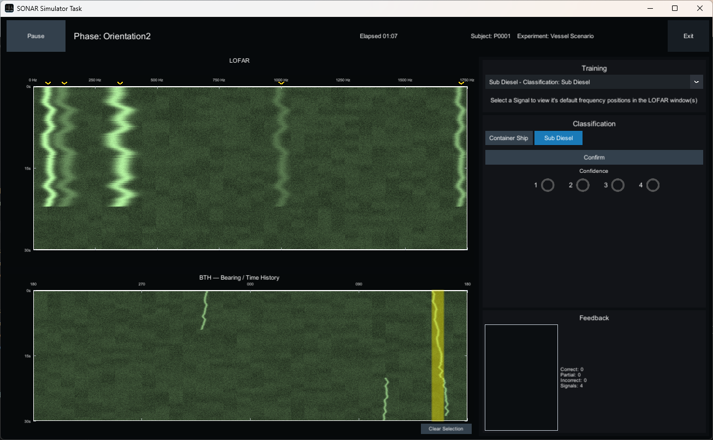

# Passive Sonar Classification Experiment

Subjects in this experiment are expected to select contacts displayed in the lower BTH waterfall display and then classify the signal seen in the upper LOFAR frequency waterfall by choosing the appropriate classification button on the right, clicking the **Confirm** button, and then choosing a confidence level (1-4). Feedback will be provided in the lower right as to whether the classification was correct or not.  Contacts which have been classified will be marked with an 'S' at the bottom of the BTH waterfall.  

## Workflow

1. Press **Start** to begin the first phase.
2. Select a bearing region (yellow bar) in the BTH by clicking a contact.
3. Inspect the LOFAR frequency history for the selected bearing aperture.
4. Choose a classification, press **Confirm**, then choose confidence **1–4**.
    - **1** — low confidence
    - **2** — somewhat confident
    - **3** — confident
    - **4** — high confidence
5. The experiment automatically pauses between phases, press **Resume** to continue.

## Screen Layout
